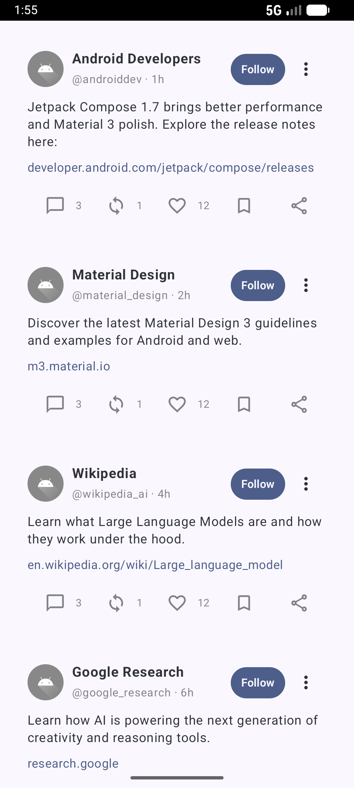
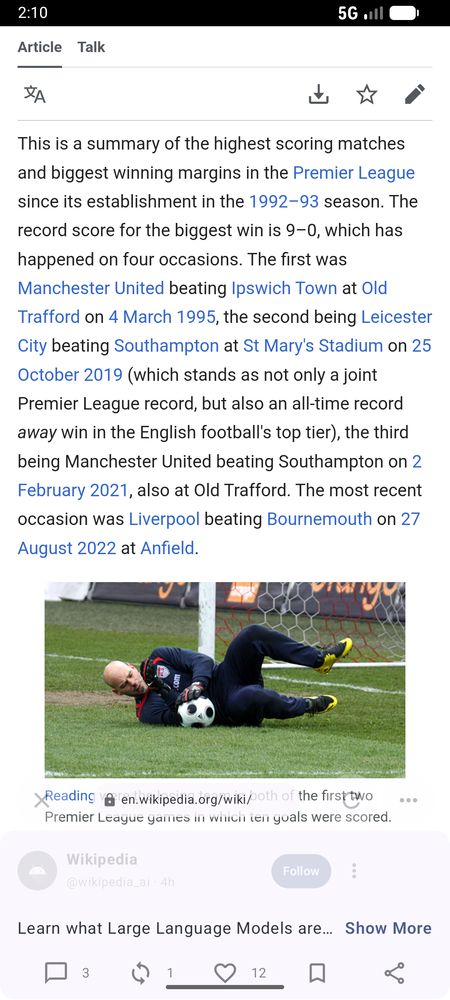
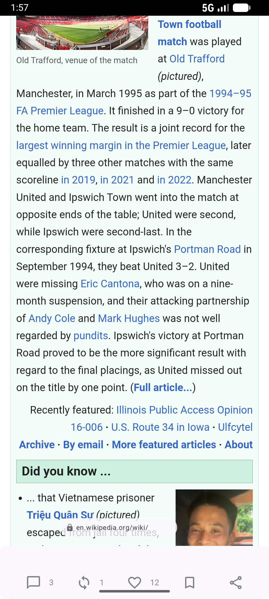

# XLink Experience (Android Demo)

This project demonstrates an Android Jetpack Compose implementation of a “link experience” similar to the new iOS feature on X. Posts with links collapse into a floating card, allowing users to engage with the post while browsing the web content. Includes smooth animations, interactive toolbar, and scroll-aware immersive WebView.

## Screenshots and Demo Video

- [Screenshots](docs/screenshots/)
- [Demo video](docs/demo/immersive-walkthrough.mp4)
- [GitHub Repository](https://github.com/go-isele/X-Link-Experience)

[Demo video](docs/demo/immersive-walkthrough.mp4)
[Youtube Demo](https://youtube.com/shorts/dAWcQq5WXHs?feature=share)

## Tech Stack
- Language: Kotlin (JVM for Android)
- UI: Jetpack Compose + Material 3
- Web: Android WebView wrapped in a Compose-friendly component
- Build system: Gradle (Kotlin DSL)
- Min/target SDK: Defined in app build.gradle.kts (35)

Package manager: Gradle (via the included Gradle Wrapper: `./gradlew`).

## Features
- Feed of posts (sample data) rendered with Compose.
- Tap a post to open its URL in a scroll-aware WebView.
- Immersive reading mode:
  - The post “floats” up from the bottom as a card.
  - Card height animates from full content to a compact toolbar-only state based on WebView scroll.
  - Corner radius, alpha, and scale animate for a polished feel.
  - Transparent floating control bar with:
    - Close
    - Reload
    - More (placeholder action)
  - Linear progress indicator while pages load.
- Post action toolbar with counts and simple interactions (like, comment, repost, bookmark, share).

## How the immersive WebView card works (implementation notes)
- Selecting a post sets `selectedPost` and shows the WebView.
- The WebView emits its vertical scroll through `scrollYFlow` (a `MutableStateFlow`).
- The screen computes `progress = (effectiveScroll / maxScrollForMinimize)` and clamps 0..1.
- Multiple animated values respond to `progress` using `animateDpAsState`:
  - `cardHeight`: shrinks from max (content) height to a toolbar-only height.
  - `offsetY`: gently lifts the card upward for a floating effect.
  - `cornerRadius`: reduces as immersion increases for a tighter look.
  - `combinedHeight`: coordinates the floating control bar with the card.
- Visibility logic derived from `progress` toggles what parts of the content are shown (full content vs. single-line preview) to keep the layout stable.

## Build and Run
Prerequisites: Android Studio (Giraffe or newer recommended), Android SDK, and a connected device or emulator.

Using command line (Gradle Wrapper):
- Debug build: `./gradlew assembleDebug`
- Install on connected device: `./gradlew installDebug`
- Run unit tests: `./gradlew testDebugUnitTest`
- Run Android instrumented tests (device/emulator required): `./gradlew connectedDebugAndroidTest`
- Lint: `./gradlew lint`

## Useful Scripts (Gradle tasks)
- Clean project: `./gradlew clean`
- Build all: `./gradlew build`
- Assemble release: `./gradlew assembleRelease` (configure signing if you plan to deploy)
- Run checks: `./gradlew check`

Note: All commands above use the included Gradle Wrapper. On Windows, use `gradlew.bat`.

## Project Structure (high-level)
- app/src/main/java/com/lanotech/xpost/MainActivity.kt – Activity entry.
- app/src/main/java/com/lanotech/xpost/ui/MainScreen.kt – Feed + immersive WebView logic.
- app/src/main/java/com/lanotech/xpost/ui/PostCard.kt – Post UI components.
- app/src/main/java/com/lanotech/xpost/ui/ScrollAwareWebView.kt – WebView wrapper with scroll reporting.
- app/src/main/java/com/lanotech/xpost/data/PostData.kt – Data model and sample content.
- app/src/main/res/drawable – Vector assets used by the UI (icons such as close, refresh, more, etc.).

## Configuration and Notes
- Networking: Uses the platform WebView to load public URLs included in `samplePosts`.
- Permissions: Standard internet permission is declared by default templates when needed (check AndroidManifest if you adjust behavior).
- Icons: Placeholder launcher icons included under mipmap/; you may replace with your branding.

## Troubleshooting
- If Gradle sync fails, ensure you are using the Android Gradle Plugin and Kotlin versions compatible with your Android Studio.
- If WebView does not show content, verify the device has internet access.
- For emulator testing, ensure Play Services or WebView implementation is present.
